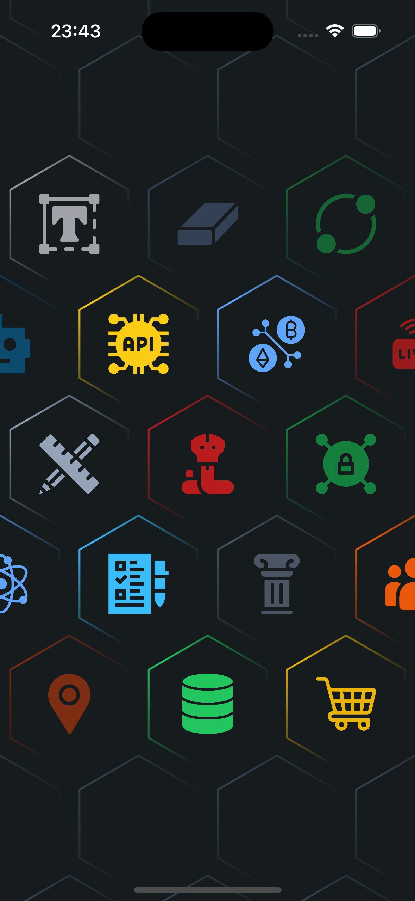
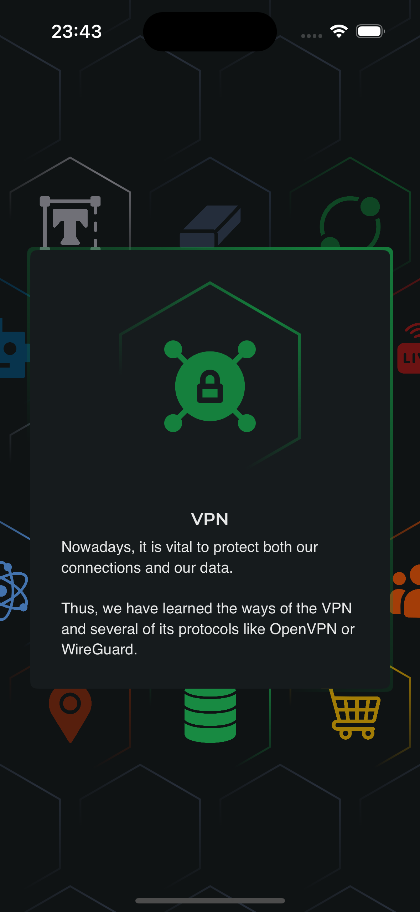
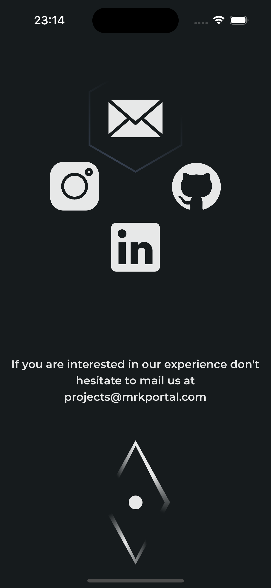
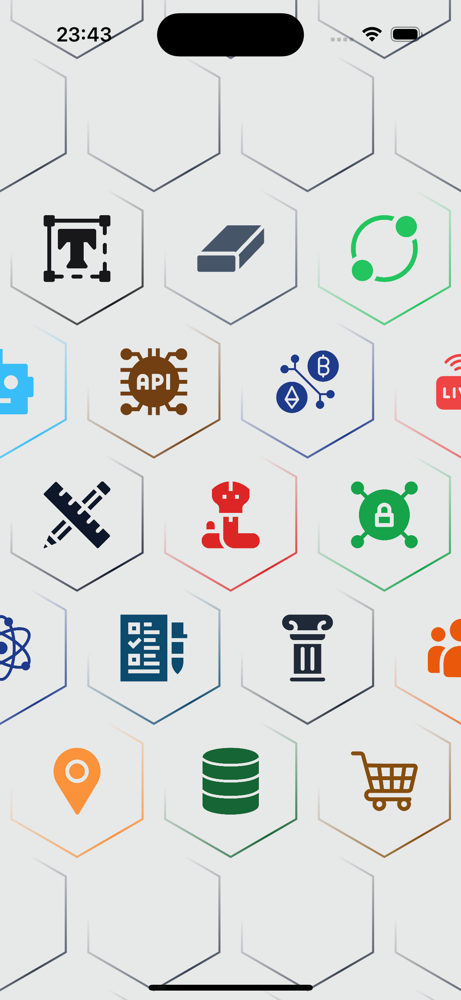
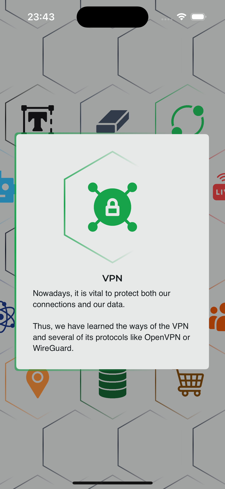
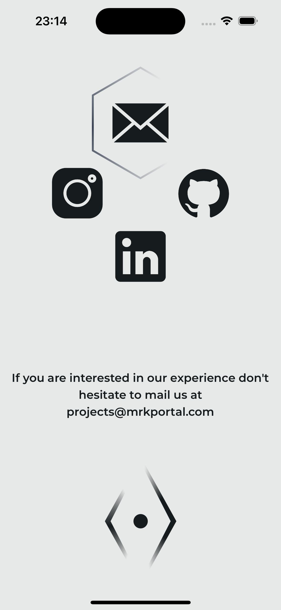

# Portfolio
A sample app for our new customers!

# Samples
Dark

  

Light

  

# Resources Disclaimer
All the icons used in the App are of free use, here's the credit for the creators:

[Freepik](https://www.flaticon.es/autores/freepik)

  

[Angara](https://www.flaticon.es/autores/anggara)

  

[Stockio](https://www.flaticon.es/autores/stockio)

  

[Icon home](https://www.flaticon.es/autores/icon-home)

  

[SumberRejeki](https://www.flaticon.es/autores/sumberrejeki)

  

[Kiranshastry](https://www.flaticon.es/autores/kiranshastry)

  

[Pixel Perfect](https://www.flaticon.es/autores/pixel-perfect)

  

[RomStu](https://www.flaticon.es/autores/romstu)

  

[Google](https://www.flaticon.es/autores/google)

  

